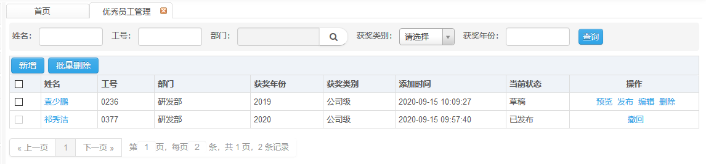
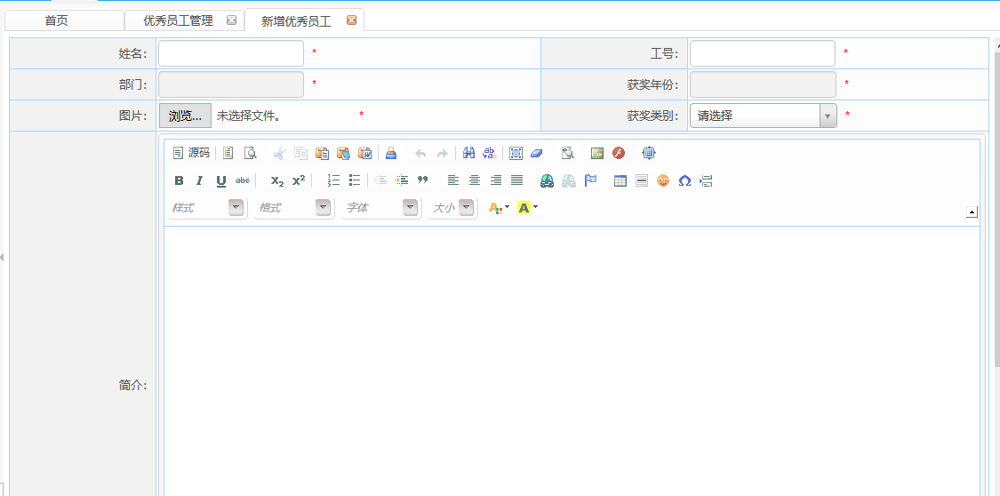
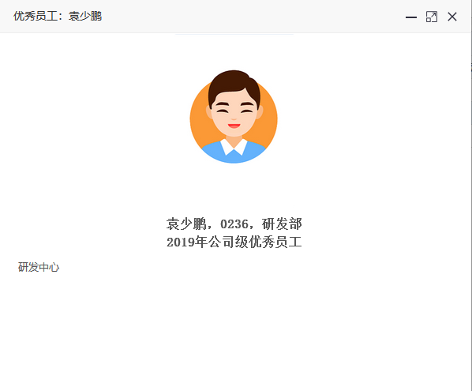
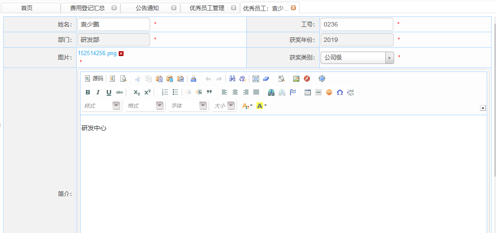
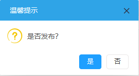

# 优秀员工管理

​      此页面显示已创建的优秀员工管理信息。

## 优秀员工管理详情

**权限说明：**通知发布员

**功能描述：**页面显示已创建的优秀员工信息。

**新增**

​       点击优秀员工管理页面中的新增按钮，在打开的新增页面中输入信息后，点击保存按钮，提示保存成功。新增的优秀员工在列表中显示。

**预览功能**

点击操作栏的预览按钮，可预览查看优秀员工信息。

**编辑功能**

点击操作栏的编辑按钮，可对已创建的优秀员工信息进行编辑。

**发布功能**

点击操作栏的发布按钮，可对已创建的优秀员工进行发布，发布后，优秀员工页面可查看到已发布的优秀员工信息。

**撤回功能**

点击操作栏的撤回功能，系统撤回已发布的优秀员工信息。

**删除与批量删除功能**

选择需要删除的数据，点击删除或批量删除按钮，提示是否确定删除选择的数据，点击取消按钮，取消删除操作；点击确定按钮，删除选择的数据。

