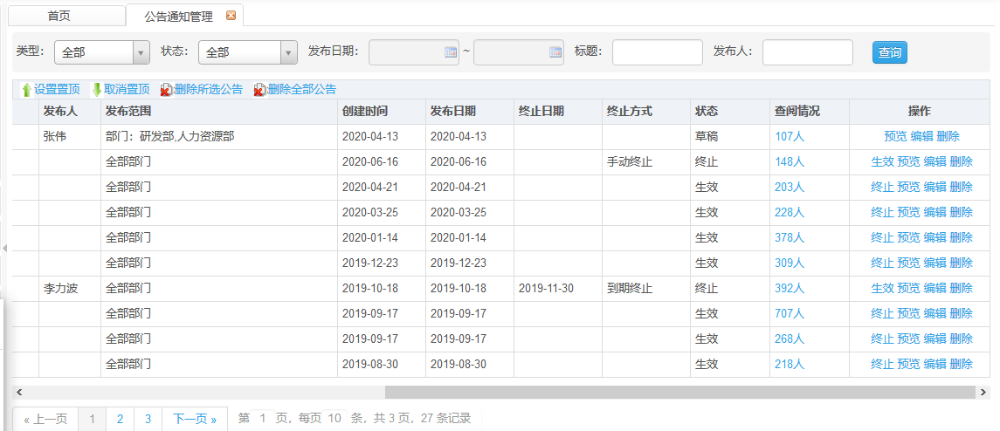

# 公告通知管理

此页面显示所有的公告通知信息。

## 公告通知管理详情

**权限说明：**通知发布员、人事

**功能描述：**页面显示所有通知和公告信息。

**预览功能**

点击操作栏的预览按钮，可对已新建的通知进行预览。

**编辑功能**

点击操作栏的编辑按钮，可对已新建的通知再次编辑。

**终止功能**

点击操作栏的终止按钮，此通知状态更新为终止状态，即不在公告通知中显示。

**生效功能**

点击操作栏的生效按钮，已终止的通知重新生效，在公告通知中显示。

**删除功能**

点击操作栏的删除按钮，对需要删除的通知进行删除操作，删除后，该通知不在系统中显示。