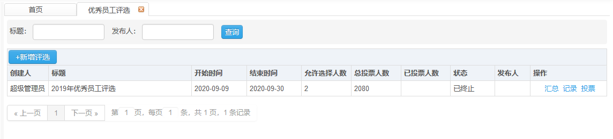
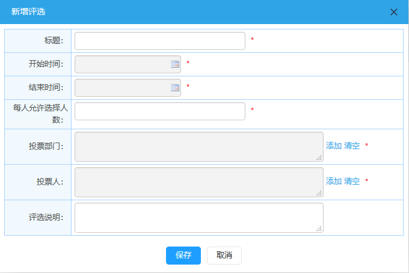
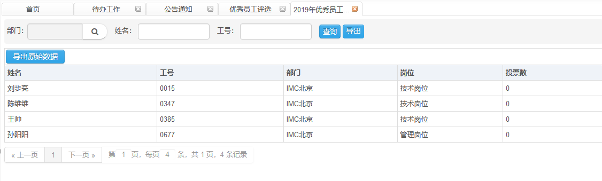
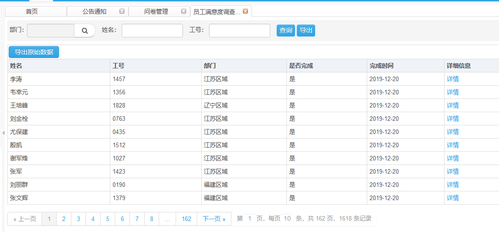
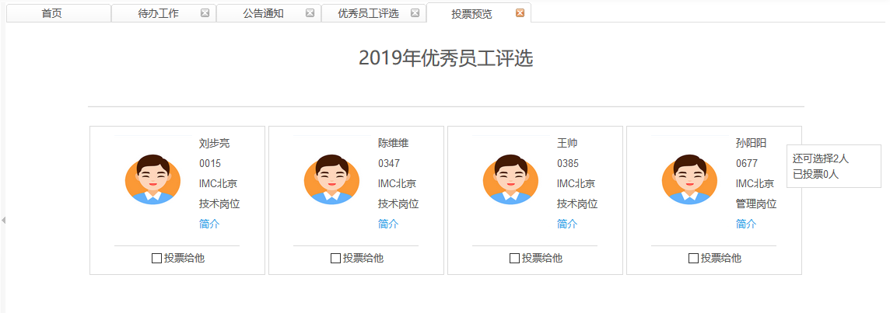

# 优秀员工评选

​      此页面显示已创建的优秀员工信息。

## 优秀员工详情

**权限说明：**通知发布员

**功能描述：**页面显示已创建的优秀员工信息。

**新增评选**

​       点击优秀员工管理页面中的新增评选按钮，在打开的新增评选页面中输入信息后，点击保存按钮，提示保存成功。新增的优秀员工在列表中显示。

**汇总功能**

点击操作栏的汇总功能，系统自动汇总所有备选员工的投票数。

**记录功能**

点击操作栏的记录功能，系统统计出公司在职员工的投票情况。

**投票功能**

点击操作栏的投票按钮，可进行投票操作。

