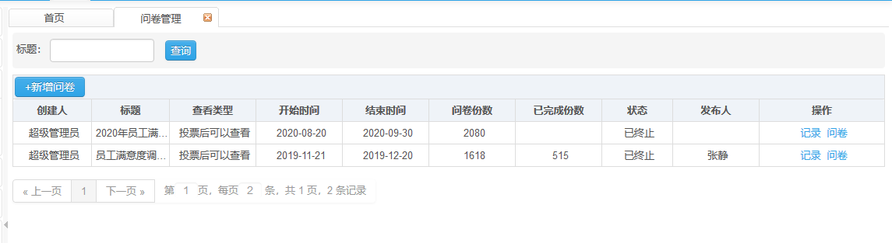
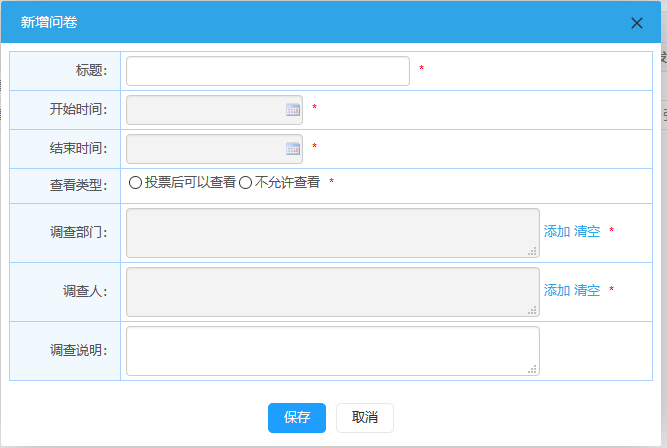
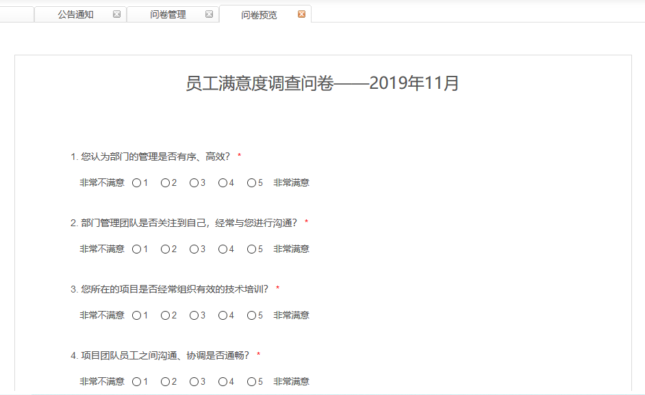
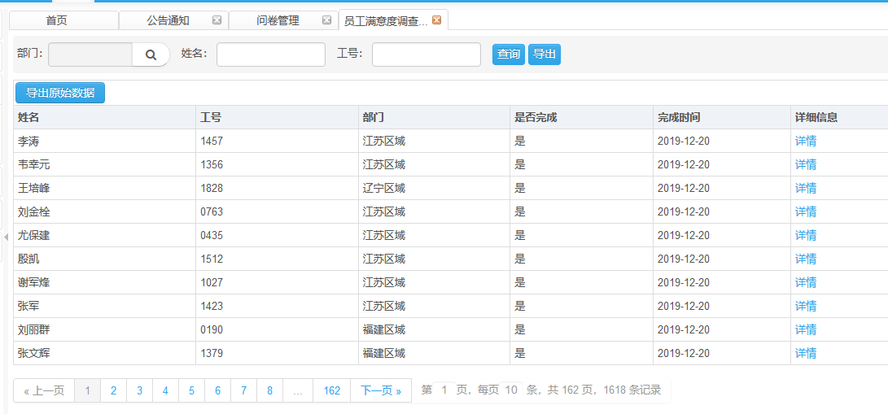
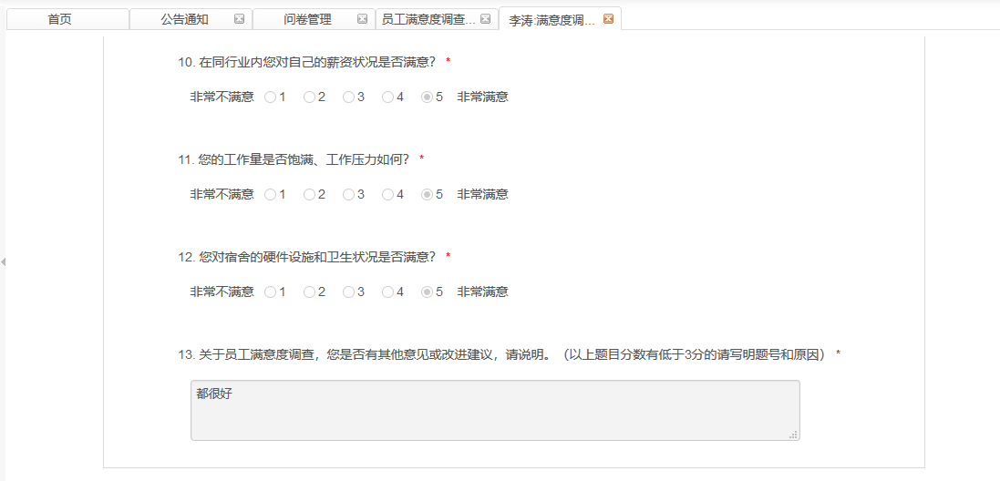

# 问卷管理

​      此页面显示已创建的问卷信息。

## 问卷管理详情

**权限说明：**通知发布员

**功能描述：**页面显示已创建的问卷信息。

**新增问卷**

​       点击问卷管理页面中的新增问卷按钮，输入信息后点击保存按钮，提示保存成功。新增的问卷在问卷管理列表中显示。

**问卷功能**

点击操作栏的问卷按钮，页签显示问卷预览。

**记录功能**

点击操作栏的记录功能，页面显示所有已完成问卷的员工信息。

**问卷详情**

点击详细信息中的详情，可查看具体每个员工的问卷内容。

