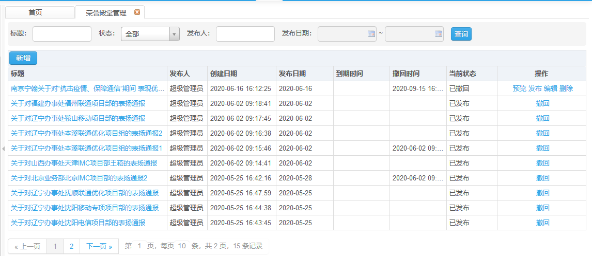
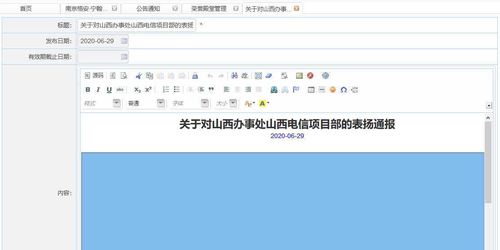

# 荣誉殿堂管理

​      此页面显示已创建的荣誉殿堂信息。

## 荣誉殿堂管理详情

**权限说明：**通知发布员

**功能描述：**页面显示已创建的荣誉殿堂信息。

**预览功能**

点击操作栏的预览按钮，可预览查看已创建的荣誉信息。

**发布功能**

点击操作栏的发布按钮，已创建的荣誉信息会发布在荣誉殿堂页面中。

**编辑功能**

点击操作栏的编辑按钮，可对已创建的荣誉信息进行编辑。

**删除功能**

点击操作栏的删除操作，弹出的提示框中选择是，可对已选择的数据进行删除。

